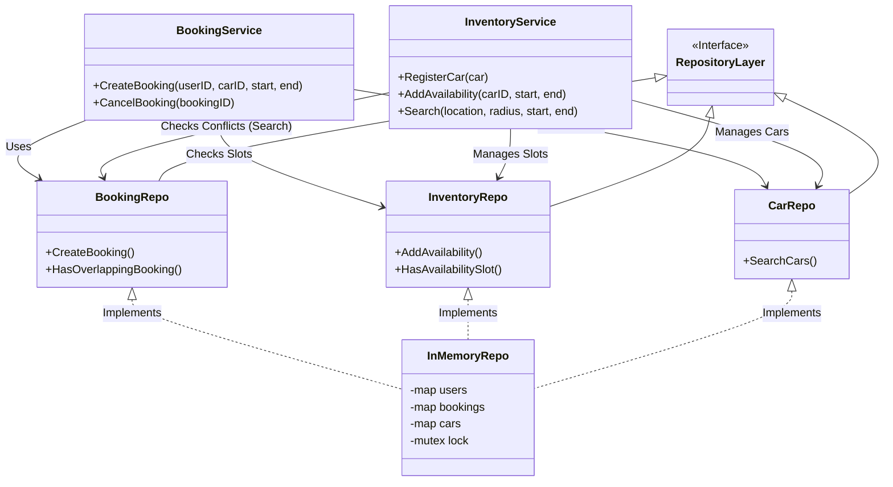

# System Architecture

The following diagram illustrates the relationships between the Services, Repositories, and the underlying Models.

```mermaid
classDiagram
    %% Services
    class BookingService {
        +CreateBooking(userID, carID, start, end)
        +CancelBooking(bookingID)
    }
    class InventoryService {
        +RegisterCar(car)
        +AddAvailability(carID, start, end)
        +Search(location, radius, start, end)
    }

    %% Repositories Interface
    class RepositoryLayer {
        <<Interface>>
    }
    class BookingRepo {
        +CreateBooking()
        +HasOverlappingBooking()
    }
    class InventoryRepo {
        +AddAvailability()
        +HasAvailabilitySlot()
    }
    class CarRepo {
        +SearchCars()
    }

    %% Relationships
    BookingService --> BookingRepo : Uses
    BookingService --> InventoryRepo : Checks Slots
    BookingService --> CarRepo : Validates Car
    
    InventoryService --> CarRepo : Manages Cars
    InventoryService --> InventoryRepo : Manages Slots
    InventoryService --> BookingRepo : Checks Conflicts (Search)

    %% Implementation
    RepositoryLayer <|-- BookingRepo
    RepositoryLayer <|-- InventoryRepo
    RepositoryLayer <|-- CarRepo
    class InMemoryRepo {
        -map users
        -map bookings
        -map cars
        -mutex lock
    }
    BookingRepo <|.. InMemoryRepo : Implements
    InventoryRepo <|.. InMemoryRepo : Implements
    CarRepo <|.. InMemoryRepo : Implements
```
