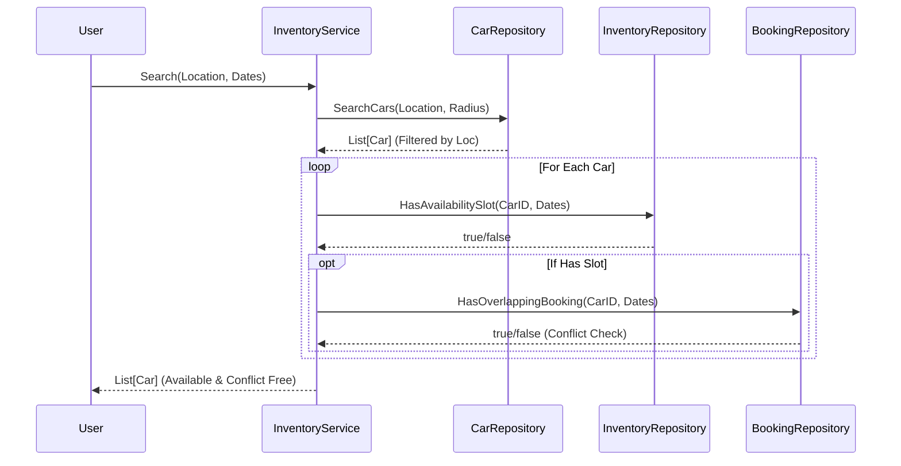
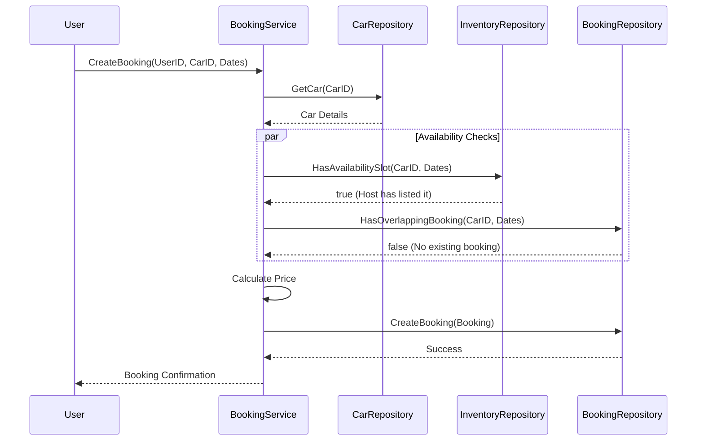

# Sequence Diagrams

## 1. Car Search Flow
This flow demonstrates how the system filters cars based on location, host availability, and existing bookings.

## 2. Booking a Car
This flow ensures data consistency and prevents double booking.

