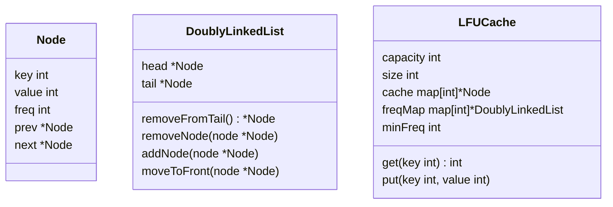

```mermaid
classDiagram
    class Node{
        key int
        value int
        freq int
        prev *Node
        next *Node
    }
    class DoublyLinkedList{
        head *Node
        tail *Node
        removeFromTail() *Node
        removeNode(node *Node)
        addNode(node *Node)
        moveToFront(node *Node)
    }
    class LFUCache{
        capacity int
        size int
        cache map[int]*Node
        freqMap map[int]*DoublyLinkedList
        minFreq int
        
        get(key int) int
        put(key int, value int)
    }

```