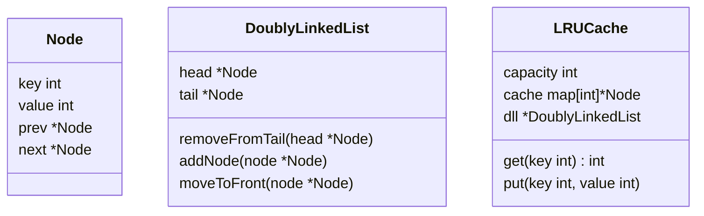

```mermaid

classDiagram
    class Node{
        key int
        value int
        prev *Node
        next *Node
    }
    class DoublyLinkedList{
        head *Node
        tail *Node
        removeFromTail(head *Node)
        addNode(node *Node)
        moveToFront(node *Node)
    }
    class LRUCache{
        capacity int
        cache map[int]*Node
        dll *DoublyLinkedList
        
        get(key int) int
        put(key int, value int)
    }

```