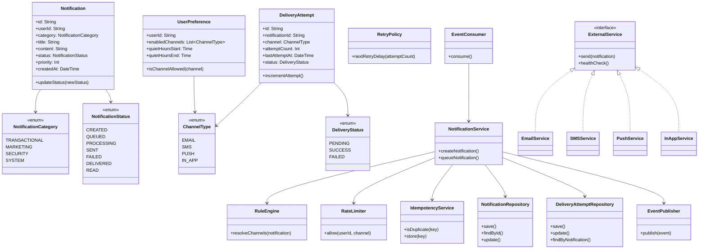

```mermaid
classDiagram

%% =========================
%% ===== DOMAIN LAYER ======
%% =========================

class Notification {
    +id: String
    +userId: String
    +category: NotificationCategory
    +title: String
    +content: String
    +status: NotificationStatus
    +priority: Int
    +createdAt: DateTime
    +updateStatus(newStatus)
}

class DeliveryAttempt {
    +id: String
    +notificationId: String
    +channel: ChannelType
    +attemptCount: Int
    +lastAttemptAt: DateTime
    +status: DeliveryStatus
    +incrementAttempt()
}

class UserPreference {
    +userId: String
    +enabledChannels: List~ChannelType~
    +quietHoursStart: Time
    +quietHoursEnd: Time
    +isChannelAllowed(channel)
}

class NotificationCategory {
    <<enum>>
    TRANSACTIONAL
    MARKETING
    SECURITY
    SYSTEM
}

class ChannelType {
    <<enum>>
    EMAIL
    SMS
    PUSH
    IN_APP
}

class NotificationStatus {
    <<enum>>
    CREATED
    QUEUED
    PROCESSING
    SENT
    FAILED
    DELIVERED
    READ
}

class DeliveryStatus {
    <<enum>>
    PENDING
    SUCCESS
    FAILED
}


Notification --> NotificationCategory
Notification --> NotificationStatus
DeliveryAttempt --> ChannelType
DeliveryAttempt --> DeliveryStatus
UserPreference --> ChannelType


%% =========================
%% == APPLICATION LAYER ====
%% =========================

class NotificationService {
    +createNotification()
    +queueNotification()
}

class RuleEngine {
    +resolveChannels(notification)
}

class RateLimiter {
    +allow(userId, channel)
}

class IdempotencyService {
    +isDuplicate(key)
    +store(key)
}

class RetryPolicy {
    +nextRetryDelay(attemptCount)
}

NotificationService --> RuleEngine
NotificationService --> RateLimiter
NotificationService --> IdempotencyService


%% =========================
%% === INFRASTRUCTURE ======
%% =========================

class NotificationRepository {
    +save()
    +findById()
    +update()
}

class DeliveryAttemptRepository {
    +save()
    +update()
    +findByNotification()
}

class EventPublisher {
    +publish(event)
}

class EventConsumer {
    +consume()
}

class ExternalService {
    <<interface>>
    +send(notification)
    +healthCheck()
}

class EmailService
class SMSService
class PushService
class InAppService

ExternalService <|.. EmailService
ExternalService <|.. SMSService
ExternalService <|.. PushService
ExternalService <|.. InAppService

EventConsumer --> NotificationService
NotificationService --> NotificationRepository
NotificationService --> DeliveryAttemptRepository
NotificationService --> EventPublisher
```