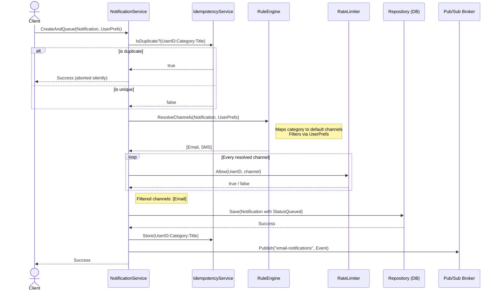
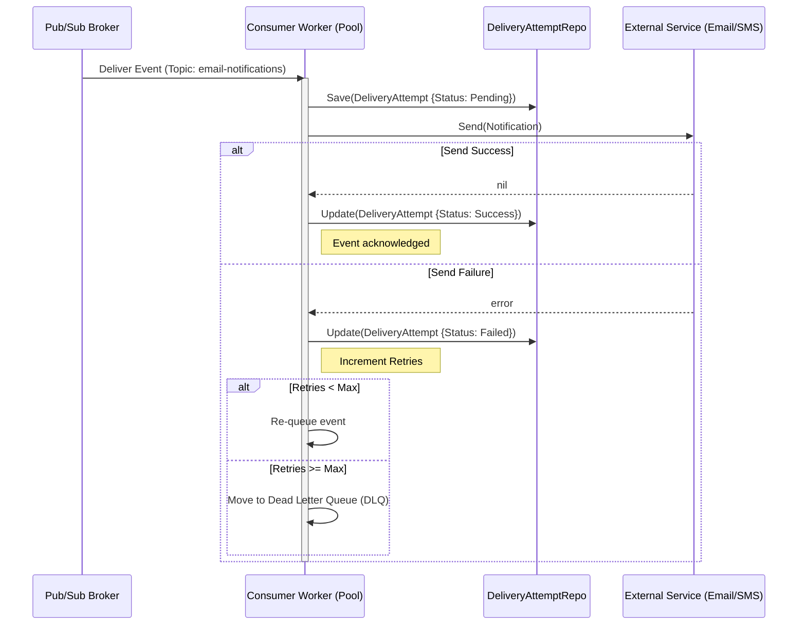
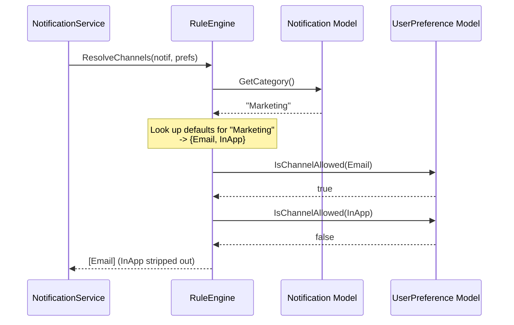

# Notification System Sequence Diagrams

## 1. Notification Dispatch Flow

```mermaid
sequenceDiagram
    actor Client
    participant Service as NotificationService
    participant Idempotency as IdempotencyService
    participant Rules as RuleEngine
    participant Limiter as RateLimiter
    participant DB as Repository (DB)
    participant Broker as Pub/Sub Broker

    Client->>Service: CreateAndQueue(Notification, UserPrefs)
    
    Service->>Idempotency: IsDuplicate?(UserID:Category:Title)
    alt is duplicate
        Idempotency-->>Service: true
        Service-->>Client: Success (aborted silently)
    else is unique
        Idempotency-->>Service: false
    end

    Service->>Rules: ResolveChannels(Notification, UserPrefs)
    Note right of Rules: Maps category to default channels<br/>Filters via UserPrefs
    Rules-->>Service: [Email, SMS]

    loop Every resolved channel
        Service->>Limiter: Allow(UserID, channel)
        Limiter-->>Service: true / false
    end
    
    Note right of Service: Filtered channels: [Email]

    Service->>DB: Save(Notification with StatusQueued)
    DB-->>Service: Success
    
    Service->>Idempotency: Store(UserID:Category:Title)
    
    Service->>Broker: Publish("email-notifications", Event)
    
    Service-->>Client: Success
```

---

## 2. Asynchronous Consumer Processing

```mermaid
sequenceDiagram
    participant Broker as Pub/Sub Broker
    participant Consumer as Consumer Worker (Pool)
    participant DB as DeliveryAttemptRepo
    participant ExtSvc as External Service (Email/SMS)

    Broker->>Consumer: Deliver Event (Topic: email-notifications)
    
    activate Consumer
    Consumer->>DB: Save(DeliveryAttempt {Status: Pending})
    
    Consumer->>ExtSvc: Send(Notification)
    
    alt Send Success
        ExtSvc-->>Consumer: nil
        Consumer->>DB: Update(DeliveryAttempt {Status: Success})
        Note right of Consumer: Event acknowledged
    else Send Failure
        ExtSvc-->>Consumer: error
        Consumer->>DB: Update(DeliveryAttempt {Status: Failed})
        Note right of Consumer: Increment Retries
        alt Retries < Max
            Consumer->>Consumer: Re-queue event
        else Retries >= Max
            Consumer->>Consumer: Move to Dead Letter Queue (DLQ)
        end
    end
    deactivate Consumer
```

---

## 3. Rule Engine Channel Resolution

```mermaid
sequenceDiagram
    participant Svc as NotificationService
    participant Rule as RuleEngine
    participant Notif as Notification Model
    participant Prefs as UserPreference Model

    Svc->>Rule: ResolveChannels(notif, prefs)
    
    Rule->>Notif: GetCategory()
    Notif-->>Rule: "Marketing"
    
    Note over Rule: Look up defaults for "Marketing"<br/>-> {Email, InApp}
    
    Rule->>Prefs: IsChannelAllowed(Email)
    Prefs-->>Rule: true
    
    Rule->>Prefs: IsChannelAllowed(InApp)
    Prefs-->>Rule: false
    
    Rule-->>Svc: [Email] (InApp stripped out)
```
