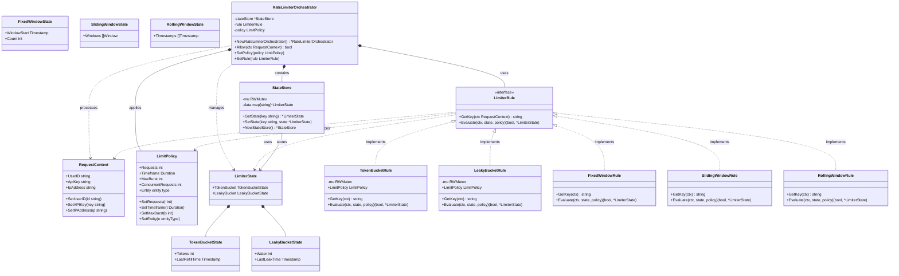

# Rate Limiter Architecture

## Overview

A flexible, extensible rate limiting system designed using **Strategy Pattern** and **Interface Segregation** principles. The system supports multiple rate limiting algorithms (Token Bucket, Leaky Bucket, Fixed/Sliding/Rolling Window) with centralized state management and algorithm-agnostic orchestration.

## System Architecture

