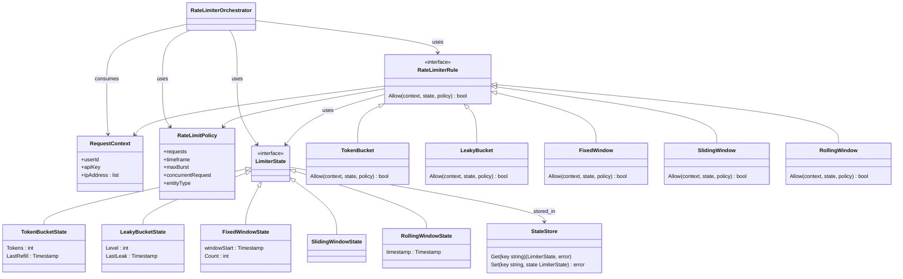

```mermaid
classDiagram

%% ===== INPUTS =====
class RequestContext {
  +userId
  +apiKey
  +IpAddress : list
}

class RateLimitPolicy {
  +requests
  +timeframe
  +maxBurst
  +concurrentRequest
  +entityType
}

%% ===== CORE INTERFACE =====
class RateLimiterRule {
  <<interface>>
  Allow(context, state, policy) bool
}

%% ===== STATE STORE =====
class StateStore {
  Get(key string) (LimiterState, error)
  Set(key string, state LimiterState) error
}

%% ===== STATE INTERFACE =====
class LimiterState {
  <<interface>>
}

%% ===== STATE IMPLEMENTATIONS =====
class TokenBucketState {
  Tokens : int
  LastRefill : Timestamp
}

class LeakyBucketState {
  Level : int
  LastLeak : Timestamp
}

class FixedWindowState {
  windowStart : Timestamp
  Count : int
}

class SlidingWindowState {
}

class RollingWindowState {
  timestamp : Timestamp
}

LimiterState <|-- TokenBucketState
LimiterState <|-- LeakyBucketState
LimiterState <|-- FixedWindowState
LimiterState <|-- SlidingWindowState
LimiterState <|-- RollingWindowState

LimiterState --> StateStore : stored_in

%% ===== LIMITER IMPLEMENTATIONS =====
class TokenBucket {
  Allow(context, state, policy) bool
}

class LeakyBucket {
  Allow(context, state, policy) bool
}

class FixedWindow {
  Allow(context, state, policy) bool
}

class SlidingWindow {
  Allow(context, state, policy) bool
}

class RollingWindow {
  Allow(context, state, policy) bool
}

RateLimiterRule <|-- TokenBucket
RateLimiterRule <|-- LeakyBucket
RateLimiterRule <|-- FixedWindow
RateLimiterRule <|-- SlidingWindow
RateLimiterRule <|-- RollingWindow

RateLimiterRule --> LimiterState : uses
RateLimiterRule --> RequestContext
RateLimiterRule --> RateLimitPolicy
%% ===== ORCHESTRATOR =====

class RateLimiterOrchestrator{

}
RateLimiterOrchestrator --> LimiterState : uses
RateLimiterOrchestrator --> RequestContext: consumes
RateLimiterOrchestrator --> RateLimitPolicy: uses
RateLimiterOrchestrator --> RateLimiterRule: uses
```