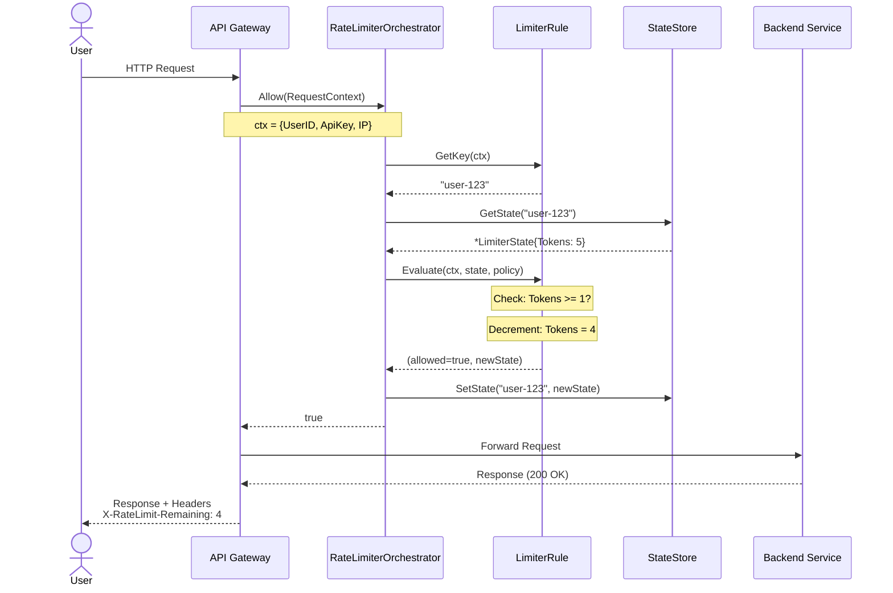
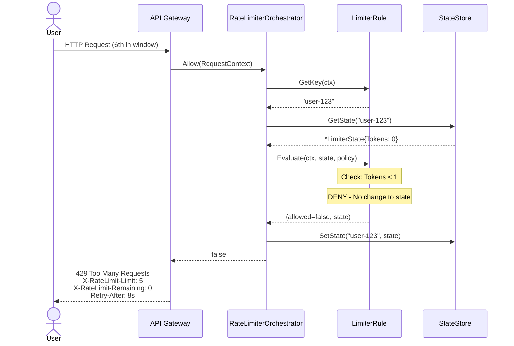
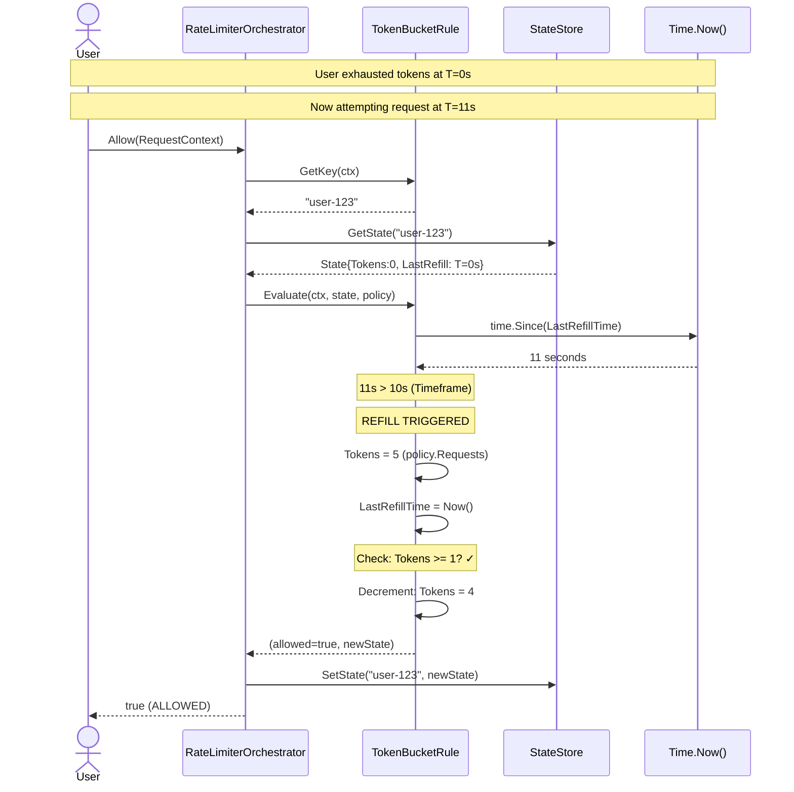
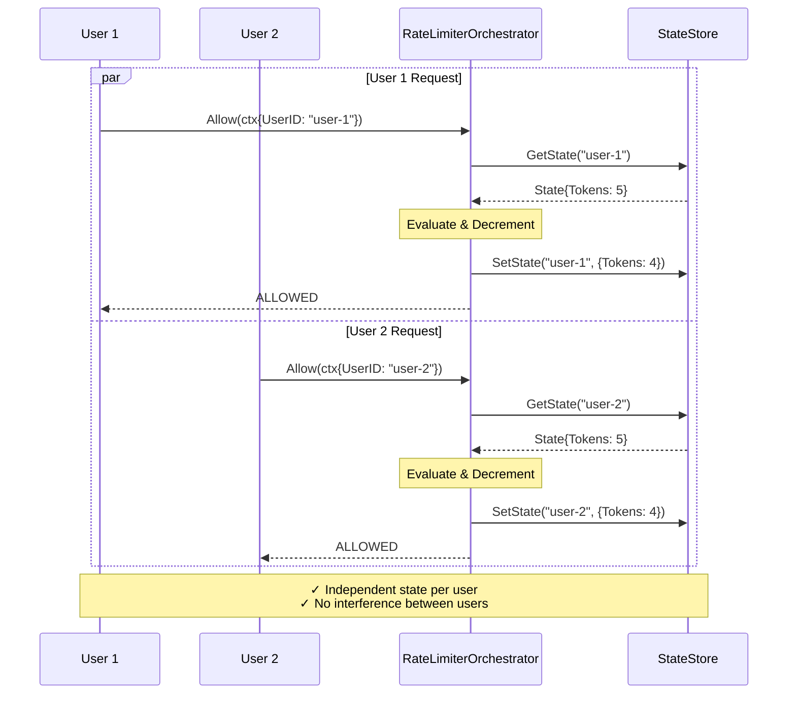
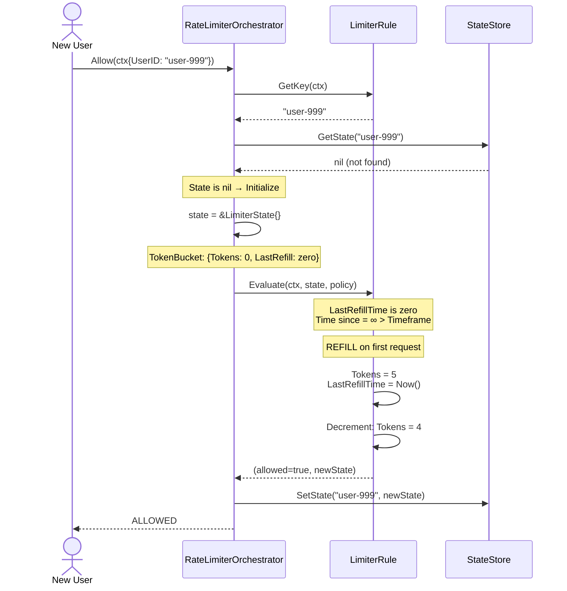
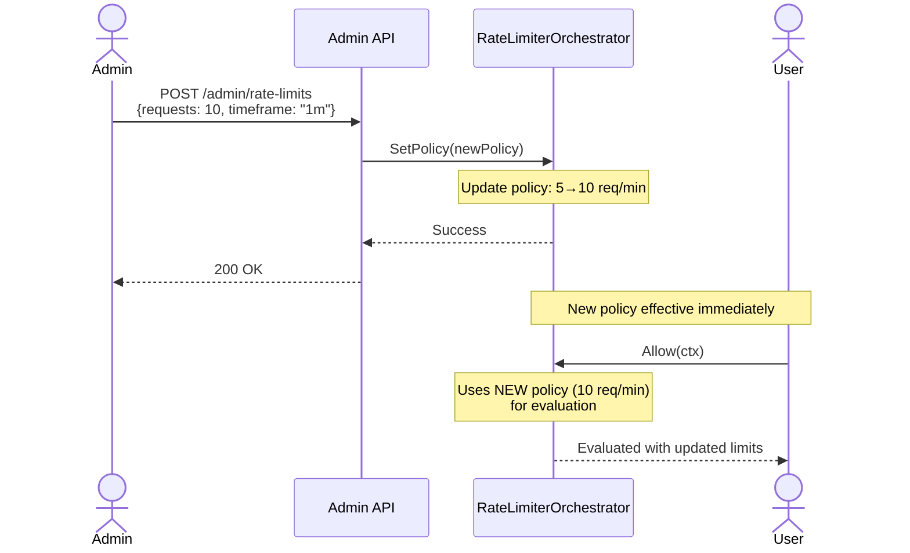
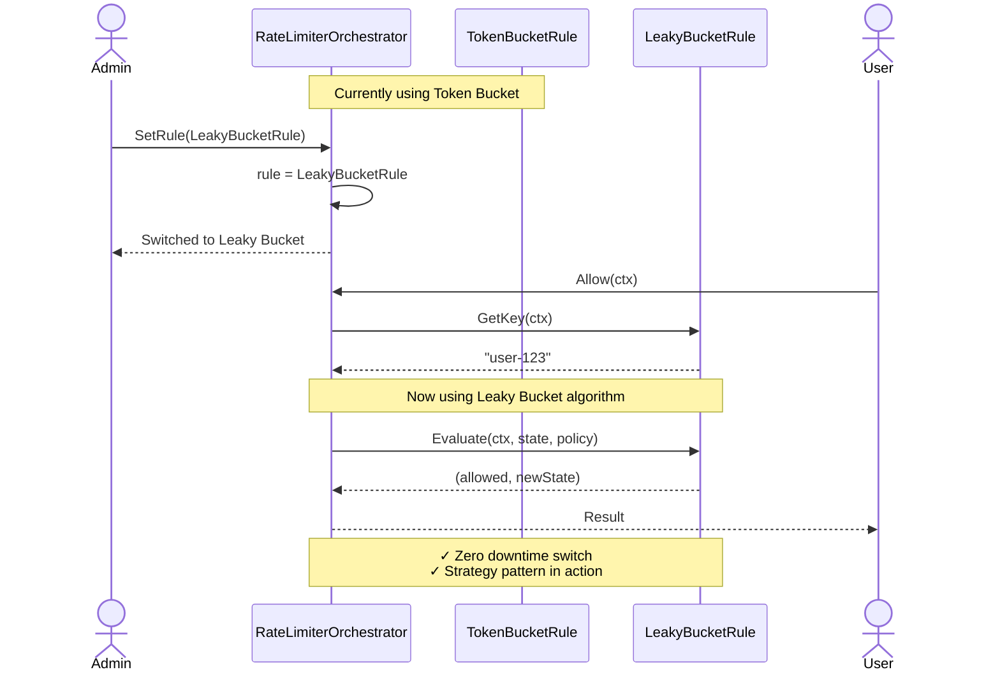
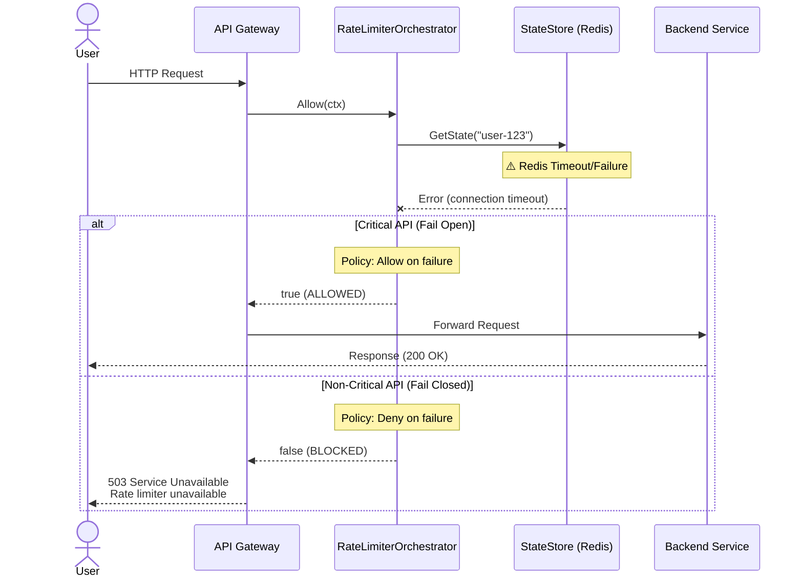
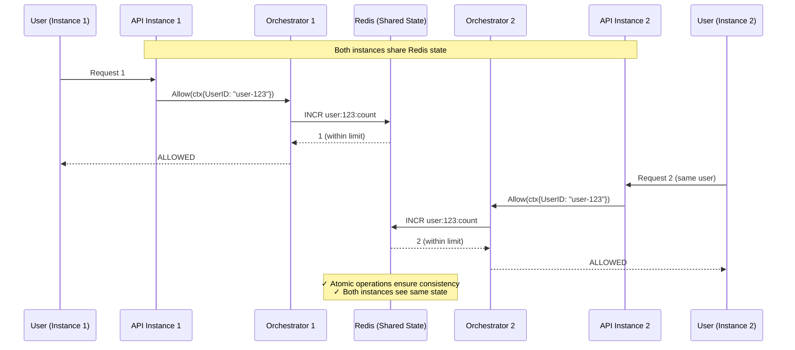
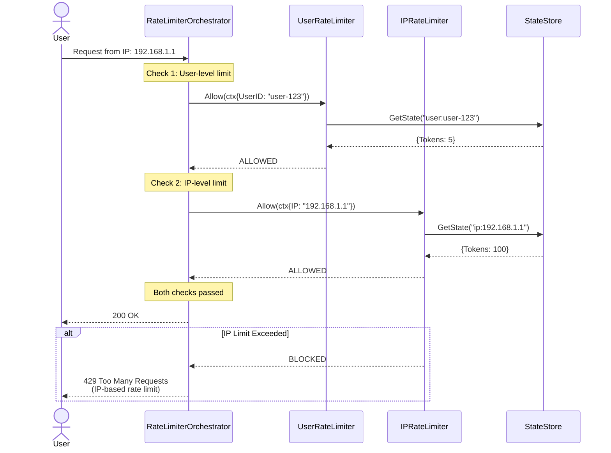

# Rate Limiter Sequence Diagrams

## 1. Basic Request Flow - Allowed Request

---

## 2. Rate Limit Exceeded - Blocked Request

---

## 3. Token Bucket Refill Flow

---

## 4. Multi-User Concurrent Requests

---

## 5. First Request (State Initialization)

---

## 6. Dynamic Policy Update Flow

---

## 7. Algorithm Switching at Runtime

---

## 8. Error Handling - StateStore Failure

---

## 9. Distributed System - Multi-Instance Coordination

---

## 10. IP-Based + User-Based Combined Limiting

---

## Key Observations

### Thread Safety
- `sync.RWMutex` in StateStore prevents race conditions
- `sync.RWMutex` in Rule implementations protects state modifications
- Concurrent requests handled safely

### State Isolation
- Each user/IP/entity has independent state
- State keyed by `GetKey()` method output
- No interference between different entities

### Atomic Operations
- Get → Evaluate → Set is NOT atomic in current implementation
- For distributed systems, use Redis Lua scripts or CAS operations

### Initialization
- First request auto-initializes state
- Zero-value LastRefillTime triggers immediate refill
- No pre-provisioning needed

### Failure Modes
- Configurable fail-open or fail-closed
- Critical APIs can bypass on errors
- Non-critical APIs deny on errors