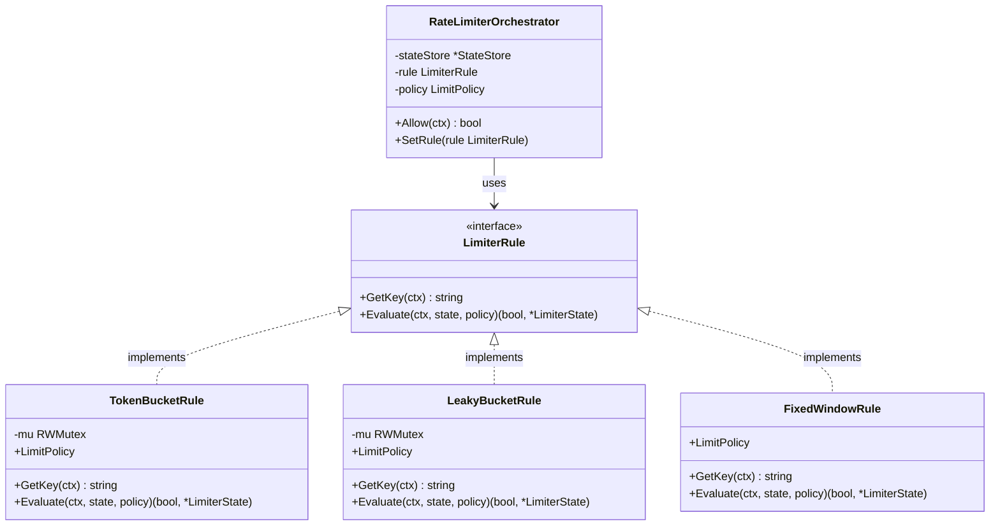
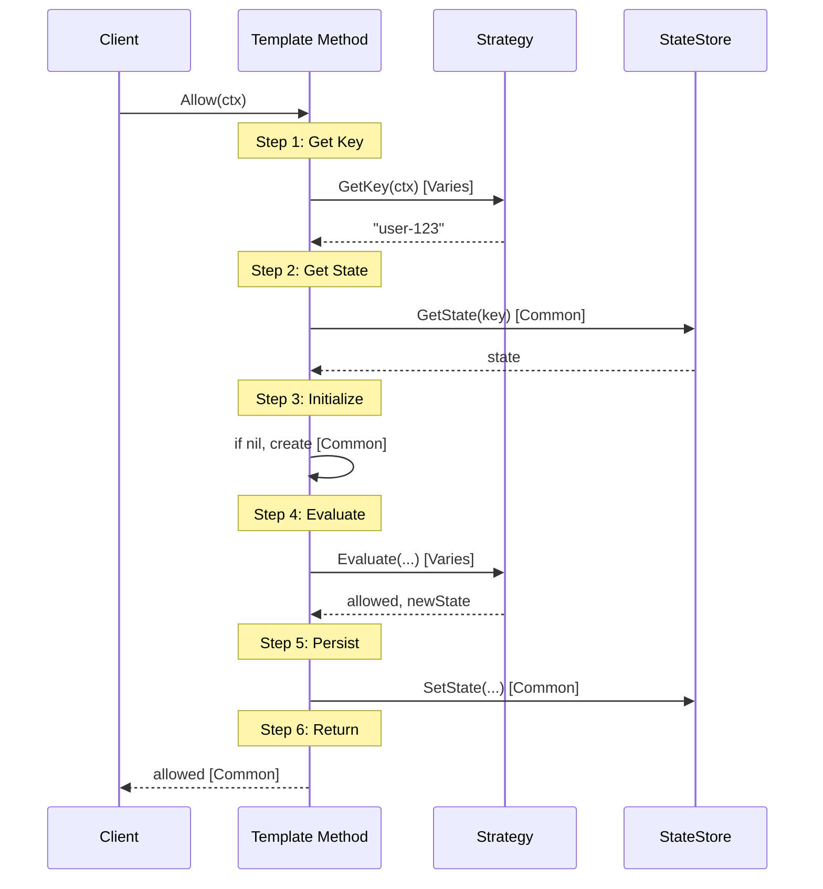
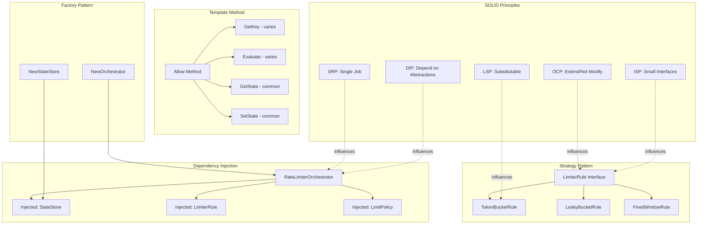

# Design Patterns in Rate Limiter

## Overview

This rate limiter system demonstrates **5 core design patterns** that work together to create a flexible, maintainable, and extensible architecture. Each pattern solves specific design challenges while maintaining loose coupling between components.

---

## 1. Strategy Pattern 🎯

### Definition
**Strategy Pattern** defines a family of algorithms, encapsulates each one, and makes them interchangeable. Strategy lets the algorithm vary independently from clients that use it.

### Problem It Solves
- Need to support multiple rate limiting algorithms (Token Bucket, Leaky Bucket, Fixed Window, etc.)
- Want to switch algorithms at runtime without changing client code
- Avoid conditional logic (if/else chains) for algorithm selection

### Implementation in Rate Limiter

#### Interface Definition
```go
// interfaces/limiter_rule.go
type LimiterRule interface {
    GetKey(ctx models.RequestContext) string
    Evaluate(ctx models.RequestContext, state *LimiterState, policy models.LimitPolicy) (bool, *LimiterState)
}
```

#### Concrete Strategies

**Strategy 1: Token Bucket Algorithm**
```go
// interfaces/limiter_rule.go
type TokenBucketRule struct {
    mu          sync.RWMutex
    LimitPolicy models.LimitPolicy
}

func (r *TokenBucketRule) GetKey(ctx models.RequestContext) string {
    return ctx.UserID
}

func (r *TokenBucketRule) Evaluate(ctx models.RequestContext, state *LimiterState, policy models.LimitPolicy) (bool, *LimiterState) {
    r.mu.Lock()
    defer r.mu.Unlock()
    
    // Token bucket algorithm implementation
    if time.Since(state.TokenBucket.LastRefillTime) > policy.Timeframe {
        state.TokenBucket.Tokens = policy.Requests
        state.TokenBucket.LastRefillTime = time.Now()
    }
    
    if state.TokenBucket.Tokens < 1 {
        return false, state
    }
    
    state.TokenBucket.Tokens -= 1
    return true, state
}
```

**Strategy 2: Leaky Bucket Algorithm (Planned)**
```go
type LeakyBucketRule struct {
    mu          sync.RWMutex
    LimitPolicy models.LimitPolicy
}

func (r *LeakyBucketRule) GetKey(ctx models.RequestContext) string {
    return ctx.UserID
}

func (r *LeakyBucketRule) Evaluate(ctx models.RequestContext, state *LimiterState, policy models.LimitPolicy) (bool, *LimiterState) {
    r.mu.Lock()
    defer r.mu.Unlock()
    
    // Leaky bucket algorithm implementation
    elapsed := time.Since(state.LeakyBucket.LastLeakTime)
    leaked := int(elapsed.Seconds() * float64(policy.Requests) / policy.Timeframe.Seconds())
    
    state.LeakyBucket.Water = max(0, state.LeakyBucket.Water - leaked)
    state.LeakyBucket.LastLeakTime = time.Now()
    
    if state.LeakyBucket.Water >= policy.MaxBurst {
        return false, state
    }
    
    state.LeakyBucket.Water += 1
    return true, state
}
```

**Strategy 3: Fixed Window Algorithm (Planned)**
```go
type FixedWindowRule struct {
    LimitPolicy models.LimitPolicy
}

func (r *FixedWindowRule) GetKey(ctx models.RequestContext) string {
    return ctx.UserID
}

func (r *FixedWindowRule) Evaluate(ctx models.RequestContext, state *LimiterState, policy models.LimitPolicy) (bool, *LimiterState) {
    now := time.Now()
    windowStart := now.Truncate(policy.Timeframe)
    
    if state.FixedWindow.WindowStart != windowStart {
        // New window - reset counter
        state.FixedWindow.WindowStart = windowStart
        state.FixedWindow.Count = 0
    }
    
    if state.FixedWindow.Count >= policy.Requests {
        return false, state
    }
    
    state.FixedWindow.Count += 1
    return true, state
}
```

#### Context (Client) Using Strategy
```go
// services/orchestrator.go
type RateLimiterOrchestrator struct {
    stateStore *StateStore
    rule       interfaces.LimiterRule  // Strategy interface
    policy     models.LimitPolicy
}

func (o *RateLimiterOrchestrator) Allow(ctx models.RequestContext) bool {
    key := o.rule.GetKey(ctx)  // Delegates to strategy
    state := o.stateStore.GetState(key)
    if state == nil {
        state = &interfaces.LimiterState{}
    }
    allowed, newState := o.rule.Evaluate(ctx, state, o.policy)  // Strategy execution
    o.stateStore.SetState(key, newState)
    return allowed
}

// Runtime algorithm switching
func (o *RateLimiterOrchestrator) SetRule(rule interfaces.LimiterRule) {
    o.rule = rule  // Change strategy at runtime
}
```

### Usage Example
```go
// main.go
func main() {
    stateStore := services.NewStateStore()
    policy := models.LimitPolicy{}
    policy.SetRequests(5)
    policy.SetTimeframe(10 * time.Second)
    
    // Strategy 1: Token Bucket
    tokenBucketRule := &interfaces.TokenBucketRule{LimitPolicy: policy}
    orchestrator := services.NewRateLimiterOrchestrator(stateStore, tokenBucketRule, policy)
    
    // Use Token Bucket algorithm
    allowed := orchestrator.Allow(ctx)
    
    // Switch to Strategy 2: Leaky Bucket (at runtime!)
    leakyBucketRule := &interfaces.LeakyBucketRule{LimitPolicy: policy}
    orchestrator.SetRule(leakyBucketRule)
    
    // Now using Leaky Bucket algorithm
    allowed = orchestrator.Allow(ctx)
}
```

### Benefits
✅ **Open/Closed Principle**: Open for extension (add new algorithms), closed for modification (orchestrator unchanged)  
✅ **Runtime Flexibility**: Switch algorithms without recompilation  
✅ **Testability**: Easy to test each algorithm in isolation  
✅ **No Conditionals**: No if/else chains for algorithm selection  

### Class Diagram


---

## 2. Dependency Injection 💉

### Definition
**Dependency Injection** is a technique where an object receives other objects that it depends on, rather than creating them internally. Dependencies are "injected" from outside.

### Problem It Solves
- Tight coupling between components
- Difficulty in unit testing (can't mock dependencies)
- Hard to change implementations
- Violation of Dependency Inversion Principle

### Implementation in Rate Limiter

#### Constructor Injection
```go
// services/orchestrator.go
type RateLimiterOrchestrator struct {
    stateStore *StateStore           // Dependency 1
    rule       interfaces.LimiterRule // Dependency 2
    policy     models.LimitPolicy     // Dependency 3
}

// Dependencies injected via constructor
func NewRateLimiterOrchestrator(
    stateStore *StateStore,
    rule interfaces.LimiterRule,
    policy models.LimitPolicy,
) *RateLimiterOrchestrator {
    return &RateLimiterOrchestrator{
        stateStore: stateStore,  // Injected
        rule:       rule,        // Injected
        policy:     policy,      // Injected
    }
}
```

#### Without DI (Tight Coupling ❌)
```go
// BAD: Creates dependencies internally
type BadOrchestrator struct {
    stateStore *StateStore
    rule       interfaces.LimiterRule
}

func NewBadOrchestrator() *BadOrchestrator {
    // Hard-coded dependencies
    return &BadOrchestrator{
        stateStore: &StateStore{data: make(map[string]*LimiterState)},
        rule:       &TokenBucketRule{},  // Can't change implementation
    }
}
```

#### With DI (Loose Coupling ✅)
```go
// GOOD: Dependencies injected
func main() {
    // Create dependencies
    stateStore := services.NewStateStore()
    rule := &interfaces.TokenBucketRule{}
    policy := models.LimitPolicy{}
    
    // Inject dependencies
    orchestrator := services.NewRateLimiterOrchestrator(stateStore, rule, policy)
}
```

### Testing Benefits

#### Unit Test with Mock StateStore
```go
// Testing with injected mock
type MockStateStore struct {
    states map[string]*interfaces.LimiterState
}

func (m *MockStateStore) GetState(key string) *interfaces.LimiterState {
    return m.states[key]
}

func (m *MockStateStore) SetState(key string, state *interfaces.LimiterState) {
    m.states[key] = state
}

func TestOrchestrator(t *testing.T) {
    // Inject mock instead of real StateStore
    mockStore := &MockStateStore{states: make(map[string]*interfaces.LimiterState)}
    rule := &interfaces.TokenBucketRule{}
    policy := models.LimitPolicy{}
    
    orchestrator := &RateLimiterOrchestrator{
        stateStore: mockStore,  // Injected mock
        rule:       rule,
        policy:     policy,
    }
    
    // Test with mock store
    allowed := orchestrator.Allow(ctx)
    assert.True(t, allowed)
}
```

### Setter Injection (Runtime Flexibility)
```go
// services/orchestrator.go

// Allows changing dependencies after construction
func (o *RateLimiterOrchestrator) SetPolicy(policy models.LimitPolicy) {
    o.policy = policy  // Runtime policy update
}

func (o *RateLimiterOrchestrator) SetRule(rule interfaces.LimiterRule) {
    o.rule = rule  // Runtime algorithm change
}
```

### Benefits
✅ **Testability**: Easy to inject mocks/stubs for testing  
✅ **Flexibility**: Can swap implementations without changing code  
✅ **Loose Coupling**: Components don't know about concrete implementations  
✅ **Configuration**: Different configurations for different environments  

---

## 3. Template Method Pattern 📋

### Definition
**Template Method Pattern** defines the skeleton of an algorithm in a method, deferring some steps to subclasses/implementations.

### Problem It Solves
- Common workflow with varying steps
- Code duplication across similar processes
- Need to enforce a specific sequence of operations

### Implementation in Rate Limiter

#### Template Algorithm in Orchestrator
```go
// services/orchestrator.go

// Template method - defines the skeleton
func (o *RateLimiterOrchestrator) Allow(ctx models.RequestContext) bool {
    // Step 1: Get key (varies by strategy)
    key := o.rule.GetKey(ctx)
    
    // Step 2: Retrieve state (common)
    state := o.stateStore.GetState(key)
    
    // Step 3: Initialize if needed (common)
    if state == nil {
        state = &interfaces.LimiterState{}
    }
    
    // Step 4: Evaluate (varies by strategy)
    allowed, newState := o.rule.Evaluate(ctx, state, o.policy)
    
    // Step 5: Persist state (common)
    o.stateStore.SetState(key, newState)
    
    // Step 6: Return decision (common)
    return allowed
}
```

### Sequence Diagram


### Common vs Variable Steps

| Step | Common/Variable | Responsibility |
|------|----------------|----------------|
| 1. Get Key | Variable | Strategy (rule.GetKey) |
| 2. Get State | Common | Template (orchestrator) |
| 3. Initialize | Common | Template (orchestrator) |
| 4. Evaluate | Variable | Strategy (rule.Evaluate) |
| 5. Persist State | Common | Template (orchestrator) |
| 6. Return Decision | Common | Template (orchestrator) |

### Benefits
✅ **Code Reuse**: Common steps implemented once  
✅ **Consistency**: All algorithms follow same workflow  
✅ **Extensibility**: New algorithms only implement variable steps  
✅ **Control**: Template controls the sequence  

---

## 4. Factory Pattern 🏭

### Definition
**Factory Pattern** provides an interface for creating objects without specifying their exact class.

### Problem It Solves
- Complex object initialization
- Need to centralize creation logic
- Hide implementation details from clients

### Implementation in Rate Limiter

#### Factory Functions
```go
// services/state_store.go

// Factory function for StateStore
func NewStateStore() *StateStore {
    return &StateStore{
        data: make(map[string]*interfaces.LimiterState),
    }
}
```

```go
// services/orchestrator.go

// Factory function for Orchestrator
func NewRateLimiterOrchestrator(
    stateStore *StateStore,
    rule interfaces.LimiterRule,
    policy models.LimitPolicy,
) *RateLimiterOrchestrator {
    return &RateLimiterOrchestrator{
        stateStore: stateStore,
        rule:       rule,
        policy:     policy,
    }
}
```

#### Usage
```go
// main.go
func main() {
    // Use factory to create objects
    stateStore := services.NewStateStore()  // Factory
    
    policy := models.LimitPolicy{}
    policy.SetRequests(5)
    policy.SetTimeframe(10 * time.Second)
    
    rule := &interfaces.TokenBucketRule{LimitPolicy: policy}
    
    // Use factory to create orchestrator
    orchestrator := services.NewRateLimiterOrchestrator(stateStore, rule, policy)
}
```

#### Advanced: Factory with Options (Planned)
```go
// Future enhancement: Functional Options Pattern
type OrchestratorOption func(*RateLimiterOrchestrator)

func WithRedisStore(addr string) OrchestratorOption {
    return func(o *RateLimiterOrchestrator) {
        o.stateStore = NewRedisStateStore(addr)
    }
}

func WithPolicy(policy models.LimitPolicy) OrchestratorOption {
    return func(o *RateLimiterOrchestrator) {
        o.policy = policy
    }
}

func NewRateLimiterOrchestrator(rule interfaces.LimiterRule, opts ...OrchestratorOption) *RateLimiterOrchestrator {
    o := &RateLimiterOrchestrator{
        stateStore: NewStateStore(),  // Default
        rule:       rule,
        policy:     models.LimitPolicy{},  // Default
    }
    
    for _, opt := range opts {
        opt(o)
    }
    
    return o
}

// Usage
orchestrator := NewRateLimiterOrchestrator(
    rule,
    WithRedisStore("localhost:6379"),
    WithPolicy(policy),
)
```

### Benefits
✅ **Encapsulation**: Hides complex initialization  
✅ **Flexibility**: Can return different implementations  
✅ **Consistency**: Single place for creation logic  
✅ **Testability**: Easy to create test fixtures  

---

## 5. SOLID Principles 🏛️

### 5.1 Single Responsibility Principle (SRP)

**Definition**: A class should have one, and only one, reason to change.

#### Implementation
Each component has one clear responsibility:

```go
// models/models.go
// Responsibility: Data structures only
type RequestContext struct {
    UserID    string
    ApiKey    string
    IpAddress string
}

type LimitPolicy struct {
    Requests   int
    Timeframe  time.Duration
    MaxBurst   int
}
```

```go
// interfaces/limiter_rule.go
// Responsibility: Rate limiting algorithms only
type TokenBucketRule struct {
    mu          sync.RWMutex
    LimitPolicy models.LimitPolicy
}

func (r *TokenBucketRule) Evaluate(...) (bool, *LimiterState) {
    // Only handles token bucket logic
}
```

```go
// services/state_store.go
// Responsibility: State persistence only
type StateStore struct {
    mu   sync.RWMutex
    data map[string]*interfaces.LimiterState
}

func (s *StateStore) GetState(key string) *interfaces.LimiterState {
    // Only handles storage retrieval
}

func (s *StateStore) SetState(key string, state *interfaces.LimiterState) {
    // Only handles storage updates
}
```

```go
// services/orchestrator.go
// Responsibility: Workflow coordination only
type RateLimiterOrchestrator struct {
    stateStore *StateStore
    rule       interfaces.LimiterRule
    policy     models.LimitPolicy
}

func (o *RateLimiterOrchestrator) Allow(ctx models.RequestContext) bool {
    // Only coordinates workflow, delegates actual work
}
```

### 5.2 Open/Closed Principle (OCP)

**Definition**: Software entities should be open for extension, but closed for modification.

#### Implementation
```go
// Adding new algorithm WITHOUT modifying orchestrator

// Step 1: Create new strategy (extension)
type SlidingWindowRule struct {
    LimitPolicy models.LimitPolicy
}

func (r *SlidingWindowRule) GetKey(ctx models.RequestContext) string {
    return ctx.UserID
}

func (r *SlidingWindowRule) Evaluate(...) (bool, *LimiterState) {
    // Sliding window algorithm
}

// Step 2: Use new strategy (no changes to orchestrator)
rule := &SlidingWindowRule{LimitPolicy: policy}
orchestrator := services.NewRateLimiterOrchestrator(stateStore, rule, policy)
// Orchestrator code unchanged! ✅
```

### 5.3 Liskov Substitution Principle (LSP)

**Definition**: Derived classes must be substitutable for their base classes.

#### Implementation
```go
// Any LimiterRule implementation can substitute another
var rule interfaces.LimiterRule

// All these are valid substitutions
rule = &TokenBucketRule{LimitPolicy: policy}
rule = &LeakyBucketRule{LimitPolicy: policy}
rule = &FixedWindowRule{LimitPolicy: policy}

// Orchestrator works with any implementation
orchestrator := services.NewRateLimiterOrchestrator(stateStore, rule, policy)
allowed := orchestrator.Allow(ctx)  // Works regardless of which rule
```

### 5.4 Interface Segregation Principle (ISP)

**Definition**: Clients should not be forced to depend on interfaces they don't use.

#### Implementation
```go
// Small, focused interface - only 2 methods
type LimiterRule interface {
    GetKey(ctx models.RequestContext) string
    Evaluate(ctx models.RequestContext, state *LimiterState, policy models.LimitPolicy) (bool, *LimiterState)
}

// NOT this (fat interface):
// type LimiterRule interface {
//     GetKey(ctx) string
//     Evaluate(...) bool
//     Reset()
//     GetStats()
//     GetHistory()
//     Export()
//     Import()
//     Validate()
//     ... 20+ methods
// }
```

### 5.5 Dependency Inversion Principle (DIP)

**Definition**: Depend on abstractions, not concretions.

#### Implementation
```go
// Orchestrator depends on INTERFACE, not concrete implementation
type RateLimiterOrchestrator struct {
    stateStore *StateStore
    rule       interfaces.LimiterRule  // ✅ Interface (abstraction)
    policy     models.LimitPolicy
}

// NOT this (depending on concrete type):
// type BadOrchestrator struct {
//     rule TokenBucketRule  // ❌ Concrete type
// }
```

---

## 6. Concurrency Patterns 🔒

### 6.1 Mutex Pattern

**Purpose**: Protect shared state from concurrent access

#### Implementation in StateStore
```go
// services/state_store.go
type StateStore struct {
    mu   sync.RWMutex  // Reader-Writer mutex
    data map[string]*interfaces.LimiterState
}

// Read operation - multiple readers allowed
func (s *StateStore) GetState(key string) *interfaces.LimiterState {
    s.mu.RLock()  // Read lock
    defer s.mu.RUnlock()
    
    if state, exists := s.data[key]; exists {
        return state
    }
    return nil
}

// Write operation - exclusive access
func (s *StateStore) SetState(key string, state *interfaces.LimiterState) {
    s.mu.Lock()  // Write lock
    defer s.mu.Unlock()
    
    s.data[key] = state
}
```

#### Implementation in TokenBucketRule
```go
// interfaces/limiter_rule.go
type TokenBucketRule struct {
    mu          sync.RWMutex  // Protects state modifications
    LimitPolicy models.LimitPolicy
}

func (r *TokenBucketRule) Evaluate(...) (bool, *LimiterState) {
    r.mu.Lock()  // Exclusive lock for state modification
    defer r.mu.Unlock()
    
    // Modify state safely
    if time.Since(state.TokenBucket.LastRefillTime) > policy.Timeframe {
        state.TokenBucket.Tokens = policy.Requests
        state.TokenBucket.LastRefillTime = time.Now()
    }
    
    state.TokenBucket.Tokens -= 1
    return true, state
}
```

### Benefits
✅ **Thread Safety**: Safe concurrent access  
✅ **Data Integrity**: No race conditions  
✅ **Performance**: RWMutex allows multiple readers  

---

## Pattern Interaction Diagram



---

## Summary

### Pattern Overview

| Pattern | Purpose | Benefit |
|---------|---------|---------|
| **Strategy** | Pluggable algorithms | Runtime algorithm switching |
| **Dependency Injection** | Loose coupling | Testability, flexibility |
| **Template Method** | Common workflow | Code reuse, consistency |
| **Factory** | Object creation | Encapsulation, simplicity |
| **SOLID** | Design principles | Maintainability, extensibility |
| **Mutex** | Thread safety | Concurrency control |

### Real-World Benefits

1. **Extensibility**: Add new algorithms without changing existing code
2. **Testability**: Easy to test with mocks and stubs
3. **Maintainability**: Clear separation of concerns
4. **Flexibility**: Runtime configuration changes
5. **Scalability**: Thread-safe for concurrent requests
6. **Readability**: Each component has clear responsibility

### Key Takeaways

✅ **Strategy Pattern** makes algorithms interchangeable  
✅ **Dependency Injection** decouples components  
✅ **Template Method** enforces consistent workflow  
✅ **Factory Pattern** simplifies object creation  
✅ **SOLID Principles** ensure clean design  
✅ **Concurrency Patterns** enable thread safety  

These patterns work together to create a **robust, flexible, and maintainable** rate limiting system that can evolve with changing requirements.
