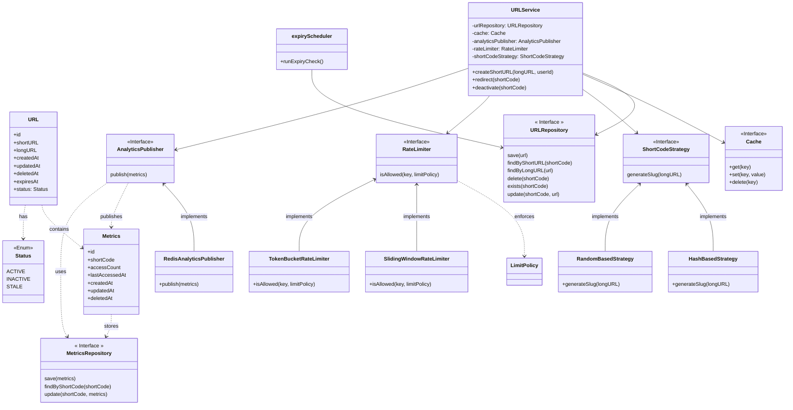

```mermaid
classDiagram
%% ===== MODELS =====

class URL {
 +id
 +shortURL
 +longURL
 +createdAt
 +updatedAt
 +deletedAt
 +expiresAt
 +status: Status
}
class Status{
    <<Enum>>
    ACTIVE
    INACTIVE
    STALE
}
class Metrics{
    +id
    +shortCode
    +accessCount
    +lastAccessedAt
    +createdAt
    +updatedAt
    +deletedAt
}
URL ..> Metrics : contains
URL ..> Status : has


%% ===== SERVICES =====

class URLService{
    -urlRepository: URLRepository
    -cache: Cache
    -analyticsPublisher: AnalyticsPublisher
    -rateLimiter: RateLimiter
    -shortCodeStrategy: ShortCodeStrategy

    +createShortURL(longURL, userId)
    +redirect(shortCode)
    +deactivate(shortCode)
}
URLService --> URLRepository
URLService --> Cache
URLService --> ShortCodeStrategy
URLService --> RateLimiter
URLService --> AnalyticsPublisher
expiryScheduler --> URLRepository

%% ===== SCHEDULERS =====
class expiryScheduler{
    +runExpiryCheck()
}
%% ===== STRATEGIES =====
class ShortCodeStrategy{
    <<Interface>>
    generateSlug(longURL)
}
class HashBasedStrategy{
    +generateSlug(longURL)
}
class RandomBasedStrategy{
    +generateSlug(longURL)
}
ShortCodeStrategy <-- HashBasedStrategy : implements
ShortCodeStrategy <-- RandomBasedStrategy : implements

%% ===== ANALYTICS =====

class AnalyticsPublisher{
    <<Interface>>
    publish(metrics)
}
class RedisAnalyticsPublisher{
    +publish(metrics)
}
AnalyticsPublisher <-- RedisAnalyticsPublisher : implements
AnalyticsPublisher ..> Metrics : publishes
Metrics ..> MetricsRepository : stores
AnalyticsPublisher ..> MetricsRepository : uses

%% ===== REPOSITORIES =====
class URLRepository{
    << Interface >>
    save(url)
    findByShortURL(shortCode)
    findByLongURL(url)
    delete(shortCode)
    exists(shortCode)
    update(shortCode, url)
}
class MetricsRepository{
    << Interface >>
    save(metrics)
    findByShortCode(shortCode)
    update(shortCode, metrics)
}

%% ===== CACHE =====
class Cache{
    <<Interface>>
    +get(key)
    +set(key, value)
    +delete(key)
}
%% ===== RATE LIMITER =====
class RateLimiter{
    <<Interface>>
    isAllowed(key, limitPolicy)
}
class SlidingWindowRateLimiter{
    +isAllowed(key, limitPolicy)
}
class TokenBucketRateLimiter{
    +isAllowed(key, limitPolicy)
}
RateLimiter ..> LimitPolicy : enforces
RateLimiter <-- SlidingWindowRateLimiter : implements
RateLimiter <-- TokenBucketRateLimiter : implements
%% ====== Dependencies ======
```