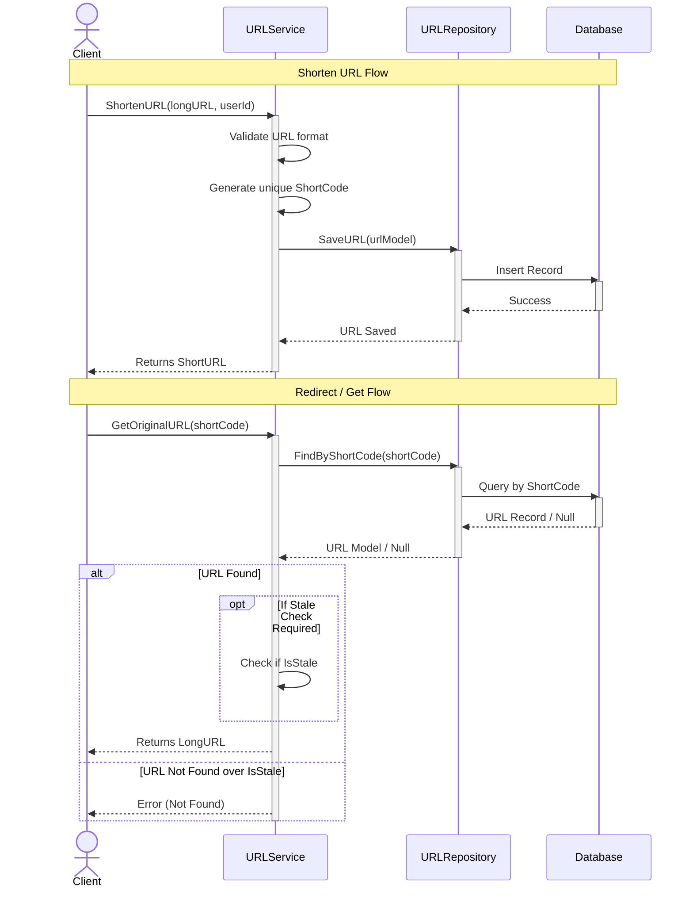

```mermaid
sequenceDiagram
    actor Client
    participant Service as URLService
    participant Repo as URLRepository
    participant DB as Database

    %% Shorten URL Flow
    Note over Client, DB: Shorten URL Flow
    Client->>Service: ShortenURL(longURL, userId)
    activate Service
    Service->>Service: Validate URL format
    Service->>Service: Generate unique ShortCode
    Service->>Repo: SaveURL(urlModel)
    activate Repo
    Repo->>DB: Insert Record
    activate DB
    DB-->>Repo: Success
    deactivate DB
    Repo-->>Service: URL Saved
    deactivate Repo
    Service-->>Client: Returns ShortURL
    deactivate Service

    %% Redirect URL Flow
    Note over Client, DB: Redirect / Get Flow
    Client->>Service: GetOriginalURL(shortCode)
    activate Service
    Service->>Repo: FindByShortCode(shortCode)
    activate Repo
    Repo->>DB: Query by ShortCode
    activate DB
    DB-->>Repo: URL Record / Null
    deactivate DB
    Repo-->>Service: URL Model / Null
    deactivate Repo

    alt URL Found
        opt If Stale Check Required
            Service->>Service: Check if IsStale
        end
        Service-->>Client: Returns LongURL
    else URL Not Found over IsStale
        Service-->>Client: Error (Not Found)
    end
    deactivate Service
```
